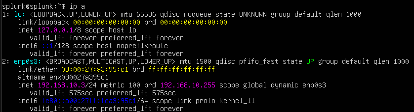
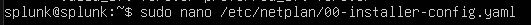
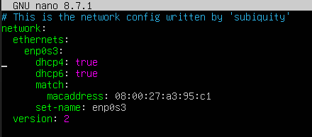
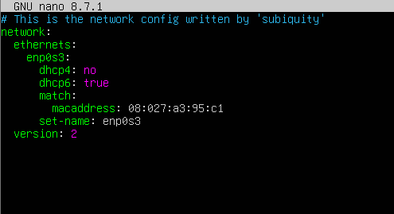
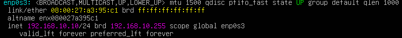
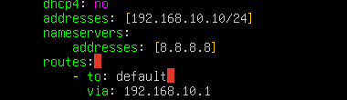
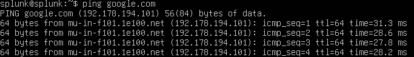

# Part 1 — Network Configuration for the Splunk Server

The first piece of the lab to get right was the network itself. My architecture diagram called for the Splunk server to sit at a specific, fixed IP address, so before installing anything I needed to make sure the Ubuntu VM was actually reachable at that address rather than whatever it had been handed by DHCP.

## Checking the current IP address

I started by checking what IP address the machine currently had, using the `ip a` command. It came back with `192.168.10.3`, picked up dynamically over DHCP — not the address my diagram called for, which meant I needed to switch the interface over to a static configuration instead.



## Editing the netplan configuration

On Ubuntu Server, network configuration lives in a netplan YAML file, so I opened it with:

```bash
sudo nano /etc/netplan/00-installer-config.yaml
```



By default, the file had the interface set to pull both its IPv4 and IPv6 addresses over DHCP:

```yaml
network:
  ethernets:
    enp0s3:
      dhcp4: true
      dhcp6: true
      match:
        macaddress: 08:00:27:a3:95:c1
      set-name: enp0s3
  version: 2
```



The first change was simply turning DHCPv4 off, since I'd be assigning the address myself:



A quick check with `ip a` on the interface showed the new address already active:



## Assigning the static address, DNS server, and route

From there, I filled in the rest of the block — the static address itself, a DNS server, and the default route:

```yaml
    enp0s3:
      dhcp4: no
      addresses: [192.168.10.10/24]
      nameservers:
          addresses: [8.8.8.8]
      routes:
        - to: default
          via: 192.168.10.1
```

I used `8.8.8.8` — Google's public DNS server — so the machine would still be able to resolve names on the internet once it was off DHCP, and pointed the default route at `192.168.10.1` as the gateway for the lab network.



With the file saved, I applied the new configuration:

```bash
sudo netplan apply
```


## Testing connectivity

Finally, I ran a quick ping test to make sure the server could actually reach the outside world — a static IP that can't talk to anything isn't much use:

```bash
ping google.com
```



With the Splunk server now sitting at a stable `192.168.10.10`, I could move on to preparing the VM for the actual Splunk installation.

**Next:** [Part 2 — Installing Splunk Enterprise](02-splunk-installation.md)
