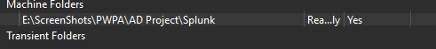
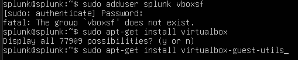
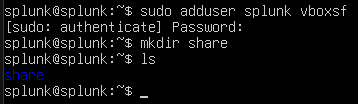
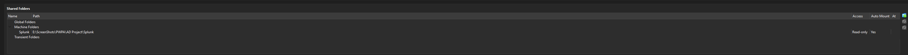
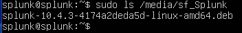
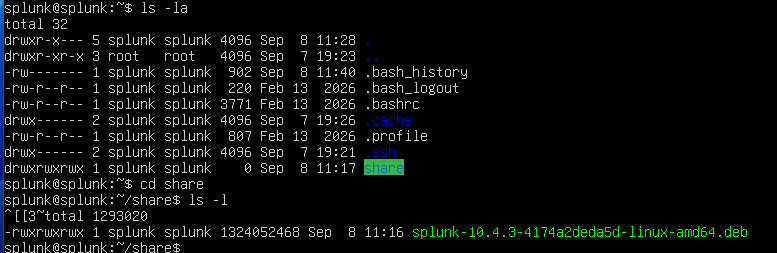
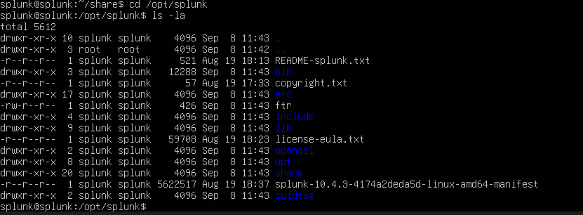
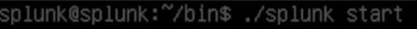
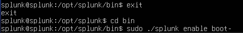
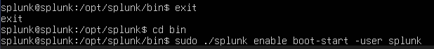

# Part 2 — Installing Splunk Enterprise

With the network sorted out, the next step was to actually get Splunk onto the Ubuntu VM. Before doing that, though, I wanted an easy way to move the (fairly large) Splunk installer over from my host machine, so I set up a VirtualBox shared folder first.

## Setting up a shared folder between host and VM

VirtualBox shared folders rely on Guest Additions, so the first step was installing the Guest Additions ISO package:

```bash
sudo apt-get install virtualbox-guestadditions-iso
```


With that in place, I pointed VirtualBox's shared folder settings at a folder on the host containing the Splunk installer:



By default, a regular user on the VM can't access shared folders — you need to be a member of the `vboxsf` group. So I tried adding my `splunk` user to that group:

```bash
sudo adduser splunk vboxsf
```


That failed, though — the `vboxsf` group didn't exist yet, because the guest-side VirtualBox utilities weren't installed. The fix was to install `virtualbox-guest-utils`, which creates that group:

```bash
sudo apt-get install virtualbox-guest-utils
```



With the guest utilities in place, I ran the `adduser` command again — this time it succeeded — and created a `share` directory to mount the folder into:



## Mounting the shared folder

Next was mounting the shared folder itself:

```bash
sudo mount -t vboxsf -o uid=1000,gid=1000 Splunk
```


I also went back and double-checked the VirtualBox shared folder settings, this time with **Auto Mount** enabled, so the folder would be available automatically going forward:



With auto mount in place, the shared folder showed up on its own at `/media/sf_Splunk`, with the Splunk installer already sitting inside it:

```bash
sudo ls /media/sf_Splunk
```



I mounted it a second time, this time directly into the `share` directory I'd created under my home folder, so I had a convenient local path to work from:

```bash
sudo mount -t vboxsf -o uid=1000,gid=1000 Splunk share/
```


A quick `ls -la` confirmed the installer — a 1.3 GB `.deb` package — was right there in `~/share`:



## Installing Splunk

With the installer accessible, I ran the actual installation:

```bash
sudo dpkg -i splunk-10.4.3-4174a2deda5d-linux-amd64.deb
```


Splunk installs itself into `/opt/splunk`:



Splunk shouldn't run as root, so I switched into the dedicated `splunk` service account before doing anything further:

```bash
sudo -u splunk bash
```


From there, I moved into Splunk's `bin` directory and started it for the first time:

```bash
cd bin
./splunk start
```




## Enabling Splunk to start on boot

The last thing I wanted to confirm was that Splunk would actually come back up on its own every time I started the VM, rather than needing to be started manually after every reboot:

```bash
sudo ./splunk enable boot-start -user splunk
```





At this point the Splunk server was fully installed, running under its own dedicated user, and set to come up automatically at `192.168.10.10`. Next, I turned to the Windows side of the lab and started preparing the target machine.

**Next:** [Part 3 — Preparing the Target Machine](03-target-machine-setup.md)
