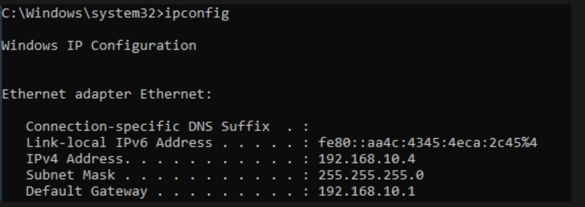
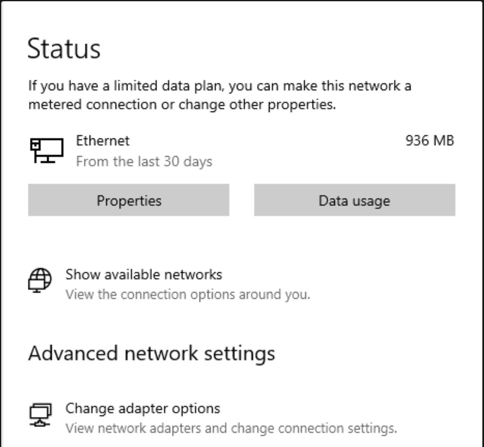
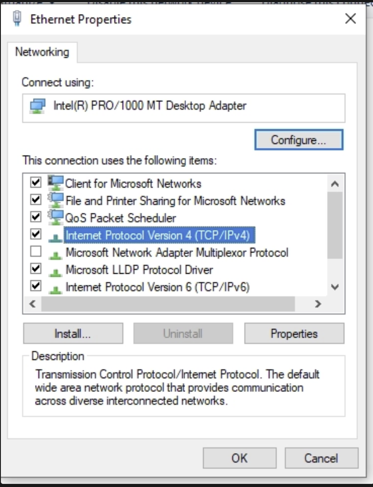
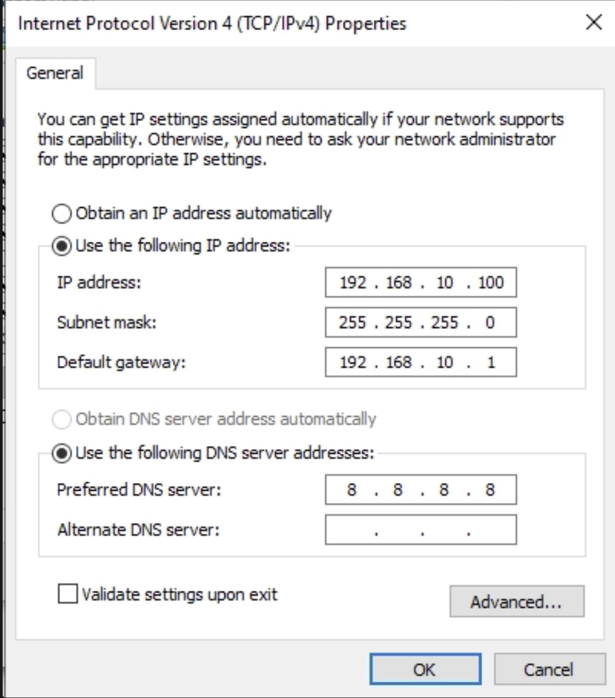
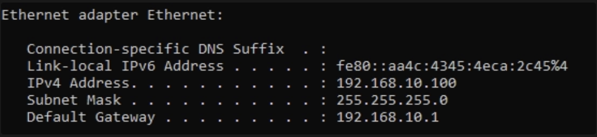

# Part 3 — Preparing the Target Machine

With Splunk running, the lab needed something to actually watch. That's the Windows 10
VM: the ordinary workstation of this environment, the machine that joins the domain
later and acts as target machine.

Before any of that it needs a name I can recognise in Splunk and an address that
doesn't move. Both matter every event that reaches Splunk carries the hostname, and
`DESKTOP-7K2J9F1` is a miserable thing to search for.

## Renaming the machine

The VM came out of the installer with the usual random name, so I renamed it to
`target-PC` under **Settings → System → About → Rename this PC**.


The rename only applies after a reboot. Afterwards, the About page confirms it:


## Checking the current address

Next I looked at what address the machine actually had:

```cmd
ipconfig
```



`192.168.10.4` — handed out by DHCP, and not the address my diagram calls for. The
target belongs at `192.168.10.100`, so this needed to become a static configuration.

## Setting a static IP address

From **Settings → Network & Internet → Status**, the way through to the adapter is
**Change adapter options** at the bottom of the page.



Right click the Ethernet adapter → **Properties**, then select **Internet Protocol
Version 4 (TCP/IPv4)** and click **Properties** again.



Then switched from DHCP to a fixed configuration:

| Field | Value |
|---|---|
| IP address | `192.168.10.100` |
| Subnet mask | `255.255.255.0` |
| Default gateway | `192.168.10.1` |
| Preferred DNS server | `8.8.8.8` |



**Worth flagging for later:** DNS points at Google's resolver, which is all this
machine needs right now. But a Windows box finds a domain by asking DNS for it, so
when this machine joins `adlab.local` in Part 9, DNS has to be repointed at the domain
controller first. Miss that and the join fails with an error that doesn't tell you
why.

## Verifying

```cmd
ipconfig
```



The address took, and the machine still reaches the internet — which is the practical
check that the gateway and DNS are right, not just the IP.

If a VM can't reach anything after this, the problem is usually VirtualBox rather than
Windows: both VMs have to be on the same network type. Two VMs on separate NAT
networks each sit in their own isolated world and will never see each other.

## Result

`target-PC` has a recognisable name and a fixed address at `192.168.10.100`. It's
ready for an agent.

**Next:** [Part 4 — Installing the Splunk Universal Forwarder](04-splunk-universal-forwarder.md)
