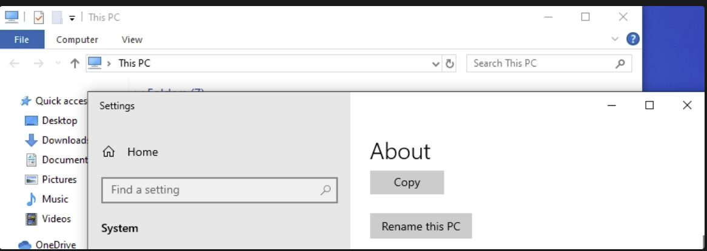

# Part 3 — Preparing the Target Machine

With Splunk running, the lab needed something to actually watch. That's the Windows 10
VM: the ordinary workstation of this environment, the machine that joins the domain
later and the one Kali eventually attacks.

Before any of that it needs a name I can recognise in Splunk and an address that
doesn't move. Both matter — every event that reaches Splunk carries the hostname, and
`DESKTOP-7K2J9F1` is a miserable thing to search for.

## Renaming the machine

The VM came out of the installer with the usual random name, so I renamed it to
`target-PC` under **Settings → System → About → Rename this PC**.



The rename only applies after a reboot, so it's worth getting out of the way first.


## Setting a static IP address

My diagram puts the target at `192.168.10.100`, on the same network as the Splunk
server. I opened the adapter's **Internet Protocol Version 4 (TCP/IPv4)** properties
from **Control Panel → Network and Sharing Center → Change adapter settings**.


Then switched from DHCP to a fixed configuration:

| Field | Value |
|---|---|
| IP address | `192.168.10.100` |
| Subnet mask | `255.255.255.0` |
| Default gateway | `192.168.10.1` |
| Preferred DNS server | `192.168.10.1` |


**Worth flagging for later:** DNS points at the gateway for now, which is all this
machine needs. But a Windows box finds a domain by asking DNS for it, so when this
machine joins `adlab.local` in Part 8, DNS has to be repointed at the domain
controller first. Miss that and the join fails with an error that doesn't tell you
why.

## Verifying

```cmd
ipconfig /all
```


And the check that actually matters — can it reach Splunk?

```cmd
ping 192.168.10.10
```


If this fails, the problem is usually VirtualBox rather than Windows: both VMs have to
be on the same network type. Two VMs on separate NAT networks each sit in their own
isolated world and will never see each other.

## Result

`target-PC` has a fixed address at `192.168.10.100` and can reach the Splunk server.
It's ready for an agent.

**Next:** [Part 4 — Installing the Splunk Universal Forwarder](04-splunk-universal-forwarder.md)
