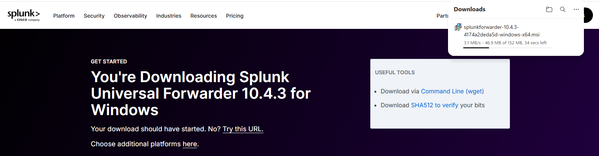
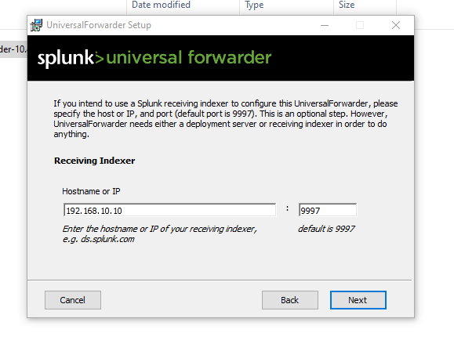
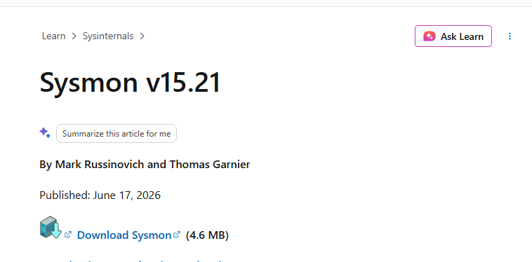
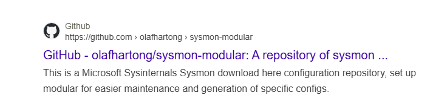
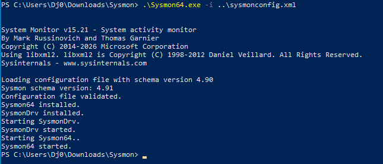

# Part 4 — Deploying Sysmon and the Splunk Universal Forwarder

Splunk is running and the target machine has a stable identity. What it doesn't have
yet is anything sending data. Two pieces fix that, and they go on the Windows 10
target, not on the Splunk server:

- **Sysmon**, which turns Windows' sparse default logging into detailed records of
  process creation, network connections and more — the events a SOC actually hunts in.
- **The Splunk Universal Forwarder**, a lightweight agent whose only job is to ship
  those logs off the endpoint and into Splunk.

## Installing the Universal Forwarder

I downloaded the forwarder from Splunk's site. The one thing that matters here is
choosing the **on-premises** instance rather than the cloud one — everything in this
lab is local, and a forwarder configured for Splunk Cloud will happily install and
then never find my server.



The installer itself is unremarkable: accept the licence, and when it asks where to
send data, that's the Splunk server. I pointed it at the server's address and let it
finish.



## Installing Sysmon

A forwarder with nothing worth forwarding is pointless, so Sysmon comes next. Out of
the box Sysmon logs almost nothing useful — its power is entirely in the
configuration you feed it. The community standard is Olaf Hartong's `sysmon-modular`
config, which is tuned to surface the events that matter for detection without
drowning you in noise.

First I downloaded Sysmon itself from Microsoft Sysinternals:



Then Olaf Hartong's `sysmon-modular` configuration — the `.xml` file that tells Sysmon
what to watch:



With both in the same folder, a single command from an elevated PowerShell installs
Sysmon and loads that configuration in one step:

```powershell
.\Sysmon64.exe -i ..\sysmonconfig.xml
```

Sysmon reports the configuration validated and the service installed and started:



## Result

The target machine now generates rich Sysmon telemetry and has a Universal Forwarder
installed and pointed at the Splunk server. Nothing is flowing into Splunk yet — the
forwarder knows *where* to send data, but the server hasn't been told what to listen
for or where to store it. That's Part 5.

**Next:** [Part 5 — Configuring Splunk to Receive Endpoint Telemetry](05-splunk-data-ingestion.md)
