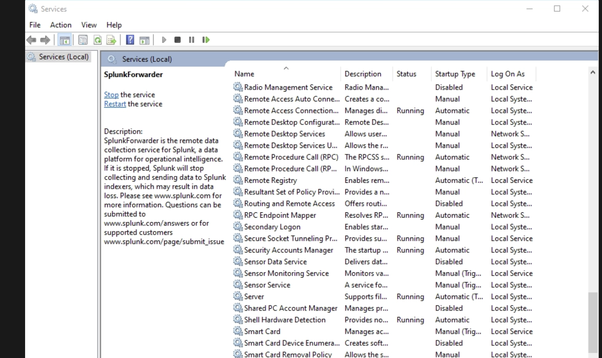
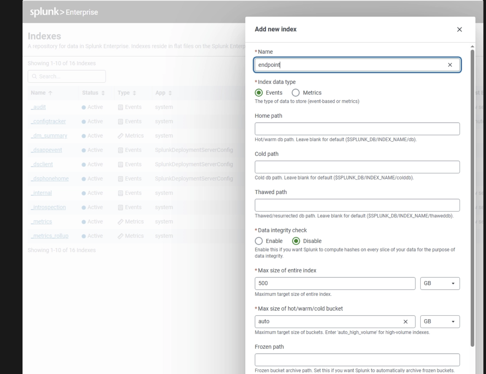
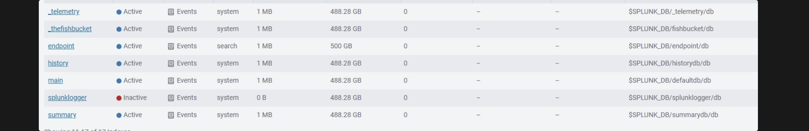
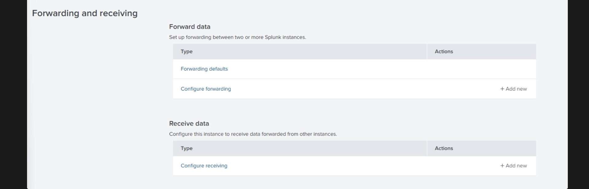
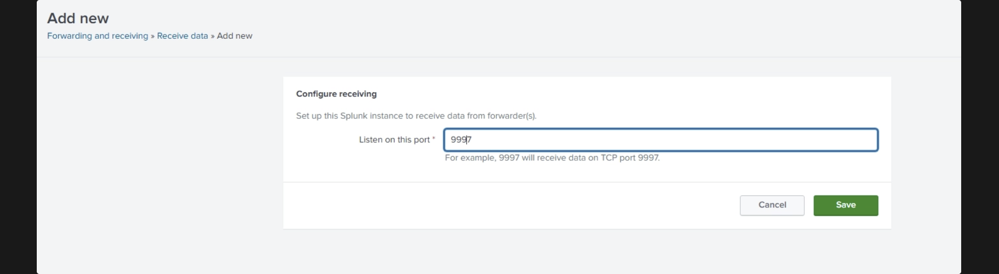
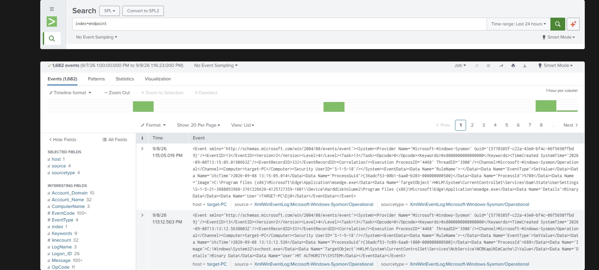

# Part 5 — Configuring Splunk to Receive Endpoint Telemetry

Sysmon and the Universal Forwarder are both running on the target machine now, but
nothing is actually flowing into Splunk yet. The forwarder knows *where* the Splunk
server is, but nothing has told it *what* to collect — and the server hasn't been
told to listen for incoming data or where to put it once it arrives. This part
closes both ends of that gap.

## Telling the forwarder what to collect

The Universal Forwarder reads `inputs.conf` to know which Windows Event Log channels
to watch and which index and sourcetype to tag that data with. I pointed it at the
Sysmon Operational log and told it to route everything into an index called
`endpoint`:

```
[WinEventLog://Microsoft-Windows-Sysmon/Operational]
disabled = false
index = endpoint
renderXml = true
sourcetype = XmlWinEventLog:Microsoft-Windows-Sysmon/Operational
```

`inputs.conf` is only read when the forwarder starts, so editing it on disk doesn't
do anything by itself — the SplunkForwarder service has to be restarted for the new
configuration to take effect.



## Creating a dedicated index on the Splunk server

An index is just where Splunk stores a category of data once it arrives — using a
dedicated `endpoint` index instead of dumping everything into `main` keeps endpoint
telemetry separate from other data in the lab, and makes permissions and retention
easier to manage later. I created it from **Settings → Indexes → New Index**, named
it `endpoint`, and left it as a standard event index:



Once created, it shows up active and ready to receive data, sized at 500 GB:



## Enabling forwarding and receiving

Having an index doesn't mean the server will accept incoming connections from a
forwarder — that has to be turned on separately, under **Settings → Forwarding and
receiving**:



Under **Receive data → Configure receiving**, I added a new receiving port. `9997`
is Splunk's standard port for forwarder-to-indexer traffic, so unless there's a
reason to change it, that's what goes here:



## Verifying the data is actually flowing

With the forwarder pointed at the server, the `endpoint` index created, and the
server listening on 9997, the only thing left is to check that events are actually
arriving. A simple `index=endpoint` search on the Splunk server confirms it — 1,682
Sysmon events from the target machine, tagged with the expected `host`, `source`,
and `sourcetype`:



## Result

Endpoint telemetry now flows automatically from the target machine's Sysmon log into
its own index on the Splunk server, with no manual step required once the forwarder
is running. This is the data pipeline the rest of the lab's searches and detections
will be built on top of. What's still missing is the Active Directory environment
itself — that's next.

**Next:** [Part 6 — Installing Windows Server and Active Directory Domain Services](06-ad-domain-services.md)
