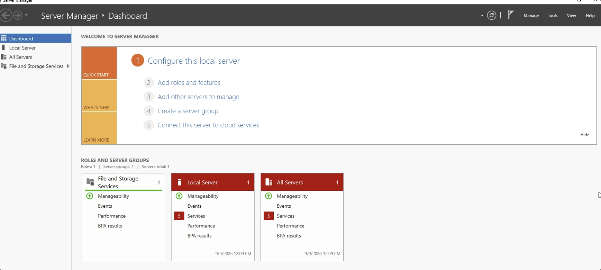
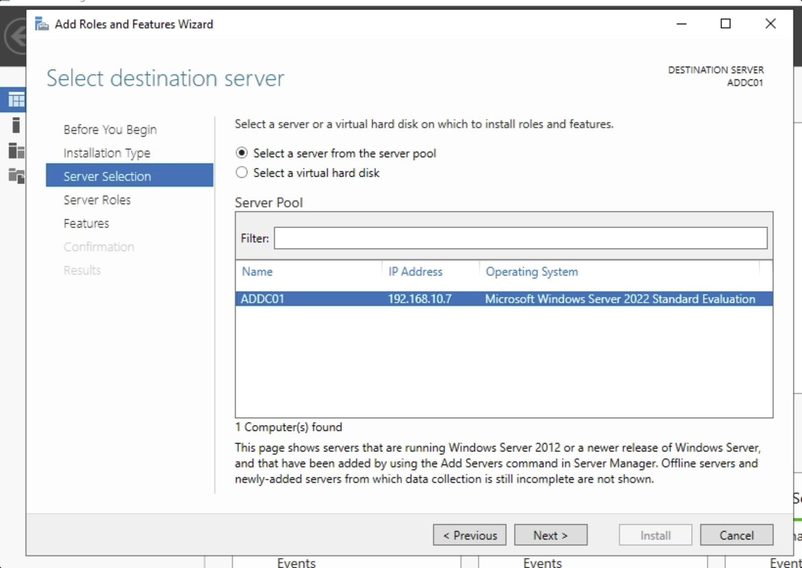
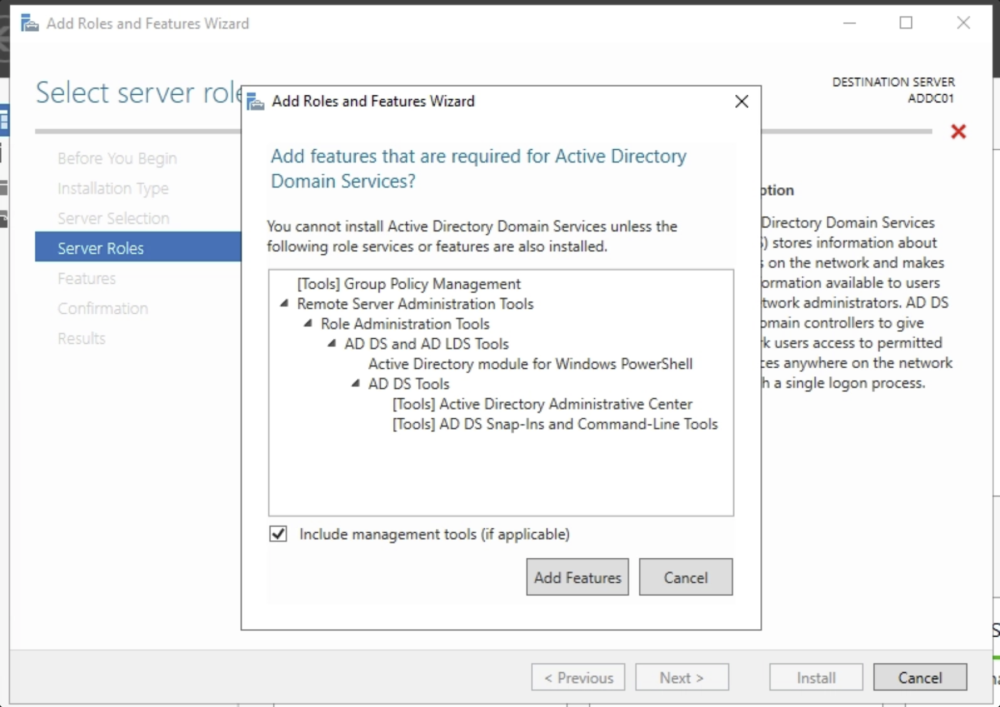
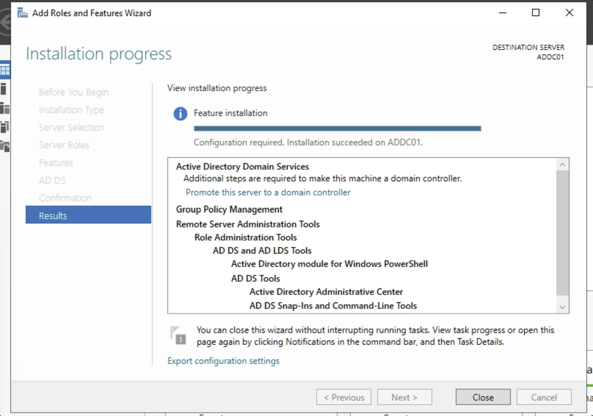
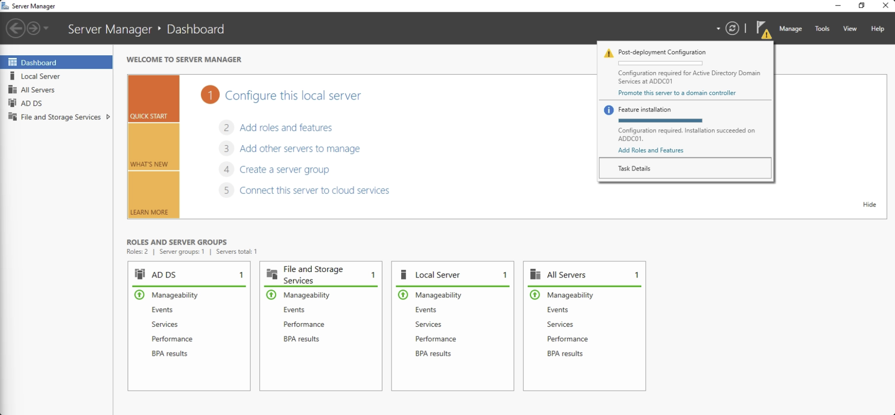
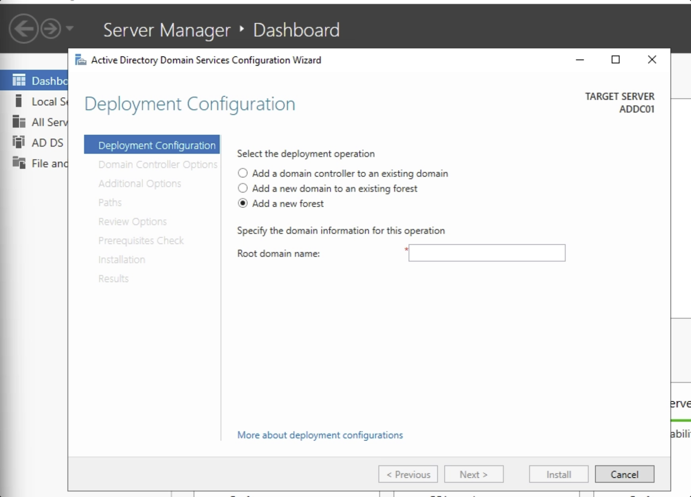

# Part 6 — Installing Windows Server and Active Directory Domain Services

With Sysmon telemetry now flowing into Splunk, the lab has a SIEM and an endpoint —
but no domain yet. Everything in this part happens on `ADDC01`, the Windows Server
2022 machine set aside for this. Standing up Active Directory is really two separate
steps: first installing the AD DS role (just the software), then separately
promoting the server so it actually becomes a domain controller.

## Installing the AD DS role

From **Server Manager → Manage → Add Roles and Features**, the wizard walks through
a few screens before anything is actually installed — confirming the installation
type, then the destination server. With only one server in the pool, that's
`ADDC01`:

On the **Server Roles** screen, checking **Active Directory Domain Services**
immediately prompts for the extra management tools it depends on — Group Policy
Management, the AD DS and AD LDS Tools, the Active Directory PowerShell module.
These have to be added for the role to install cleanly, so it's just **Add
Features** and continue:

Nothing on the Features screen itself needs changing, so it's Next through to
**Install**, and then a wait while Windows installs the role:

## Promoting the server to a domain controller

Installing the role only makes the AD DS software available on the machine — it
doesn't create a domain by itself. Server Manager flags the missing step with a
notification flag (the small yellow warning triangle in the toolbar):
**Post-deployment Configuration — Promote this server to a domain controller.**

Clicking that link opens the **Active Directory Domain Services Configuration
Wizard**. Since this is the very first domain controller in the lab, the deployment
operation is **Add a new forest** — a forest is a completely new, self-contained AD
structure, as opposed to joining or extending one that already exists. The root
domain name here is `adlab.local`, the domain the rest of the lab is built around:

The screens that follow ask for a Directory Services Restore Mode (DSRM) password —
a separate recovery password only ever used if AD itself needs to be restored from
offline recovery mode, not something used day to day — and then it's Next through
NetBIOS name, paths, and a review of the selected options. Once the prerequisites
check passes, **Install** kicks off the actual promotion, and the server reboots on
its own when it's done. After that restart, `ADDC01` is a domain controller for
`adlab.local`.

## Result

`ADDC01` is now a working domain controller, with a brand-new `adlab.local` forest
behind it. The domain exists, but it's still empty — no organizational structure and
no users yet. That's next.

**Next:** [Part 7 — Creating Organizational Units and Users](07-ad-organizational-units-and-users.md)
