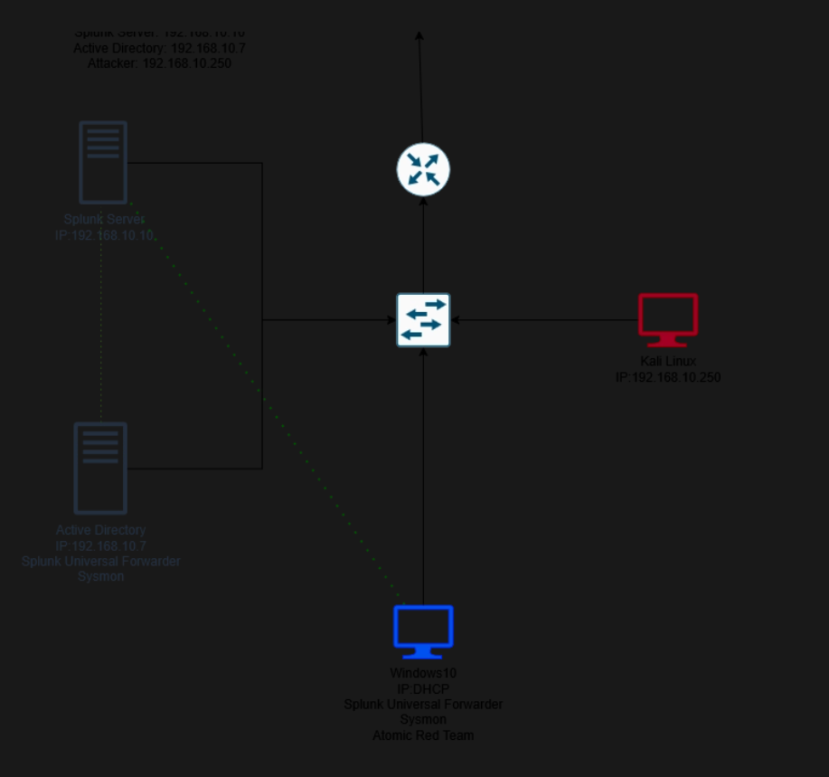

# Building a SOC Home Lab: Splunk, Sysmon, and Active Directory

This project documents building an Active Directory home lab from scratch, entirely on VirtualBox, with one goal driving the whole design: learn Active Directory and Splunk together, by actually attacking my own domain and watching what that looks like in the telemetry. The lab configures a real domain, joins a user's machine to it, and collects that machine's telemetry in Splunk ,and then a Kali Linux box attacks it, starting with a brute-force attack against the domain accounts, with Atomic Red Team runs planned next to cover a broader set of MITRE ATT&CK techniques. The point isn't just to get the attack to work, it's to go find it afterward in Splunk and understand exactly how telemetry looks from the SOC side.

The lab is built around four virtual machines:

- **An Ubuntu server running Splunk Enterprise**, which acts as the central log-collection and analysis platform (the SIEM).
- **A Windows 10 target machine**, which represents a typical end-user workstation, equipped with Sysmon and the Splunk Universal Forwarder so that its activity is captured and shipped to Splunk in near real time.
- **A Windows Server machine**, promoted to a Domain Controller, which provides the Active Directory environment — the organizational units, users, and domain that the target machine ultimately joins.
- **A Kali Linux machine**, playing the attacker — running a brute-force attack against the domain's user accounts, with Atomic Red Team runs planned next, so I can see what each technique actually looks like in Splunk.

The high-level architecture of the lab is shown below.

## Why this project

I'm transitioning from a background in industrial instrumentation and automation into cybersecurity, with SOC Analyst L1 role as my target. Reading about Active Directory or detection engineering only gets you so far , I wanted a lab where I'd actually built the domain myself, actually attacked it myself, and could watch it. Attacking my own environment with a brute-force run and, later, Atomic Red Team is what makes the Splunk side of this concrete. This repository is both my own build log and, I hope, something useful for anyone else putting together a similar lab. Lab design inspired by MyDFIR.

## How this documentation is organized

Each part below covers one stage of the build, in the order I actually did the work. I'd recommend following them in sequence if you're building this lab yourself, since later parts assume the machines and services set up in earlier ones are already in place.

1. **[Part 1 — Network Configuration for the Splunk Server](01-splunk-server-network-configuration.md)**
   Setting a static IP address on the Ubuntu VM so the Splunk server has a predictable, fixed address on the lab network.

2. **[Part 2 — Installing Splunk Enterprise](02-splunk-installation.md)**
   Setting up a VirtualBox shared folder between the host and the Linux VM, then installing and configuring Splunk to run as its own service user.

3. **[Part 3 — Preparing the Target Machine](03-target-machine-setup.md)**
   Renaming the Windows target VM and giving it a static IP address so it has a stable identity on the network.

4. **[Part 4 — Deploying Sysmon and the Splunk Universal Forwarder](04-sysmon-and-universal-forwarder.md)**
   Installing the Universal Forwarder and Sysmon (with the Olaf Hartong configuration) on the target machine so its process, network, and system events are captured in detail.

5. **[Part 5 — Configuring Splunk to Receive Endpoint Telemetry](05-splunk-data-ingestion.md)**
   Writing `inputs.conf` on the forwarder, creating a dedicated `endpoint` index, and enabling forwarding and receiving on the Splunk server so the data actually flows in.

6. **[Part 6 — Installing Windows Server and Active Directory Domain Services](06-windows-server-ad.md)**
   Adding the AD DS role and promoting the server to a domain controller for a brand-new forest.

7. **[Part 7 — Creating Organizational Units and Users](07-ad-users-and-ous.md)**
   Structuring the directory with IT and HR organizational units and populating them with users.

8. **[Part 8 — Joining the Target Machine to the Domain](08-domain-join.md)**
   Connecting the Windows target VM to the new domain, including the DNS fix needed for the machine to actually find the domain controller, and logging in with a domain account for the first time.

Parts 1–8 cover getting the SIEM, the target machine, and the domain up and talking to each other  the defensive side of the lab. The Kali VM comes into play in the next phase: a brute-force attack against the domain's user accounts, followed by Atomic Red Team runs to cover a broader set of MITRE ATT&CK techniques, with the telemetry from each checked against what actually lands in Splunk. I'll add those as further parts once that work is documented.

## A note on the architecture diagram

Every step below is illustrated with the actual screenshot taken at the time, already sitting in each part's `images/` folder and ready to publish. The one exception is the architecture diagram referenced at the top of this page (`images/00-lab-architecture-diagram.png`) — that's a separate draw.io export rather than a screenshot, so I'll need to drop that file in myself before publishing.

## Environment

- **Hypervisor:** Oracle VirtualBox
- **SIEM / log platform:** Splunk Enterprise 10.4.3 (Ubuntu Server, `192.168.10.10`)
- **Endpoint telemetry:** Sysmon v15.21 (Olaf Hartong's `sysmon-modular` configuration) + Splunk Universal Forwarder 10.4.3
- **Target machine:** `target-PC`, Windows 10, `192.168.10.100`
- **Directory services:** Windows Server 2022, Active Directory Domain Services (`ADDC01`, `192.168.10.7`)
- **Domain:** `adlab.local`, with **IT** and **HR** organizational units
- **Attack box:** Kali Linux — brute-force attacks against AD accounts, then Atomic Red Team for broader MITRE ATT&CK coverage
